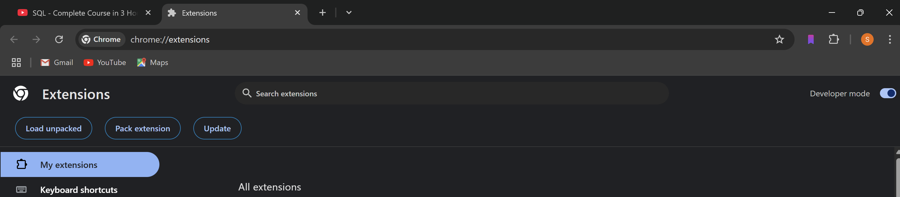
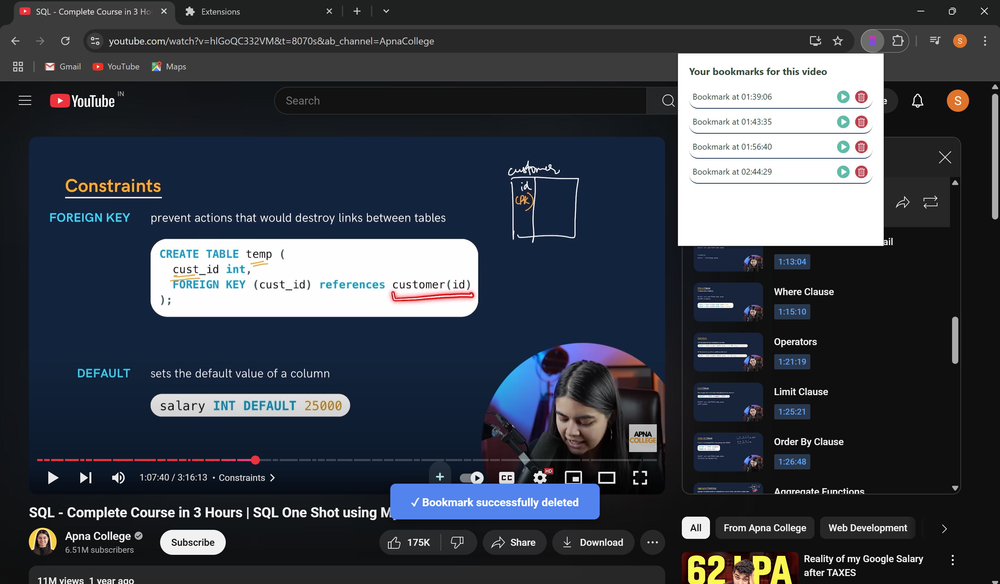
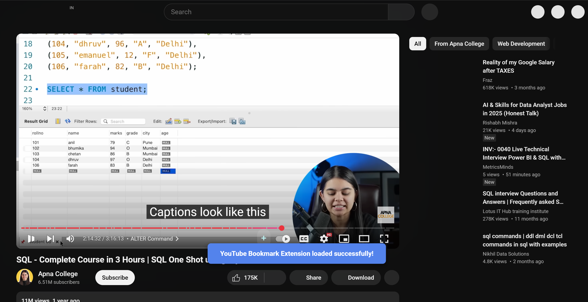

# **⏱️📌 YouTube Timestamp Bookmarker**


🚀 *Bookmark your favorite moments on YouTube effortlessly!* 🚀  
This Chrome extension lets you quickly add, view, and manage bookmarks on YouTube videos while providing instant visual feedback for each action.


---

## 📥 Installation & Setup

### 🔹 Step 1: Clone or Download the Repository

- **Clone:**
  Open your terminal and run:
  ```bash
  git clone https://github.com/harshendram/Youtube-Extension-Ready-To-Use-.git
  ```
- **Or Download:**
  Download the latest ZIP from the repository and unzip it.

### 🔹 Step 2: Load the Extension in Chrome

1. Open Chrome and navigate to:  
   ```
   chrome://extensions/
   ```
2. Enable **Developer Mode** by toggling the switch at the top right.


3. Click **Load unpacked** and select the `youtube-extension` folder from the unzipped/cloned repository.

---

## 🎯 Using the Extension

### ✅ **1. Adding a Bookmark**

- **How to:**  
  While watching a YouTube video, click on the **➕ (plus)** icon to add a bookmark at the current timestamp.
- **What Happens:**  
  A notification pops up confirming that the bookmark has been added.
- **Visual Feedback:**  
    
  *Figure: A success message appears when a bookmark is added.*

---

### 📑 **2. Viewing Bookmarks**

- **How to:**  
  Click on the extension icon in your browser toolbar.
- **What Happens:**  
  A list of your saved bookmarks appears, complete with **▶ (play)** and **🗑️ (delete)** buttons for each entry.
- **Visual Feedback:**  
    
  *Figure: The bookmark list display with options to play or delete each bookmark.*

---

### ❌ **3. Deleting a Bookmark**

- **How to:**  
  In the bookmark list, click on the **🗑️ (delete)** icon next to the bookmark you wish to remove.
- **What Happens:**  
  A notification pops up confirming that the bookmark has been deleted.
- **Visual Feedback:**  
    
  *Figure: A deletion message confirms the bookmark was removed.*

---

## ⚙️ Optional Configuration

If you want the extension to display a custom notification (with an image) when it loads, modify your `contentScript.js` file as follows:

```diff
if (youtubeLeftControls && youtubePlayer) {
  // YouTube player is ready, load the extension
  newVideoLoaded();
+  createNotification("YouTube Bookmark Extension loaded successfully!");
} else {
  setTimeout(initExtension, 1000);
}
```


  
*Figure: Notification with a custom image upon extension load.*

---

## 💡 Contributing & Issues

Contributions, feature enhancements, and bug fixes are always welcome! 🚀

- **Contributing:**
  1. **Fork** the repository.
  2. Create a new branch (`git checkout -b feature/your-feature`).
  3. Commit your changes and push your branch.
  4. Open a **pull request** with a detailed description.
- **Opening Issues:**
  If you encounter problems or have suggestions, please open an **issue** in the GitHub repository.

🔗 **GitHub Repo:** [Youtube-Extension-Ready-To-Use](https://github.com/harshendram/Youtube-Extension-Ready-To-Use-)

---

## 📜 License

This project is licensed under the **MIT License**. See the [LICENSE](LICENSE) file for details.

```plaintext
MIT License

Copyright (c) 2025 Harshendra

Permission is hereby granted, free of charge, to any person obtaining a copy
of this software and associated documentation files (the "Software"), to deal
in the Software without restriction, including without limitation the rights
to use, copy, modify, merge, publish, distribute, sublicense, and/or sell
copies of the Software, and to permit persons to whom the Software is
furnished to do so, subject to the following conditions:

The above copyright notice and this permission notice shall be included in all
copies or substantial portions of the Software.

THE SOFTWARE IS PROVIDED "AS IS", WITHOUT WARRANTY OF ANY KIND, EXPRESS OR
IMPLIED, INCLUDING BUT NOT LIMITED TO THE WARRANTIES OF MERCHANTABILITY,
FITNESS FOR A PARTICULAR PURPOSE AND NONINFRINGEMENT. IN NO EVENT SHALL THE
AUTHORS OR COPYRIGHT HOLDERS BE LIABLE FOR ANY CLAIM, DAMAGES OR OTHER
LIABILITY, WHETHER IN AN ACTION OF CONTRACT, TORT OR OTHERWISE, ARISING FROM,
OUT OF OR IN CONNECTION WITH THE SOFTWARE OR THE USE OR OTHER DEALINGS IN THE
SOFTWARE.
```

---

✨ *Enjoy bookmarking your favorite YouTube moments!* 🎥💾

